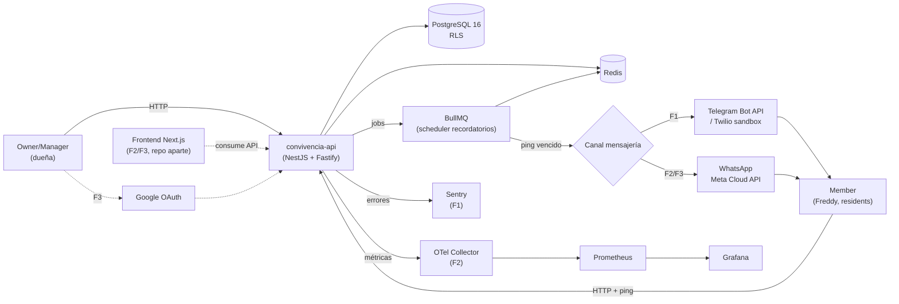
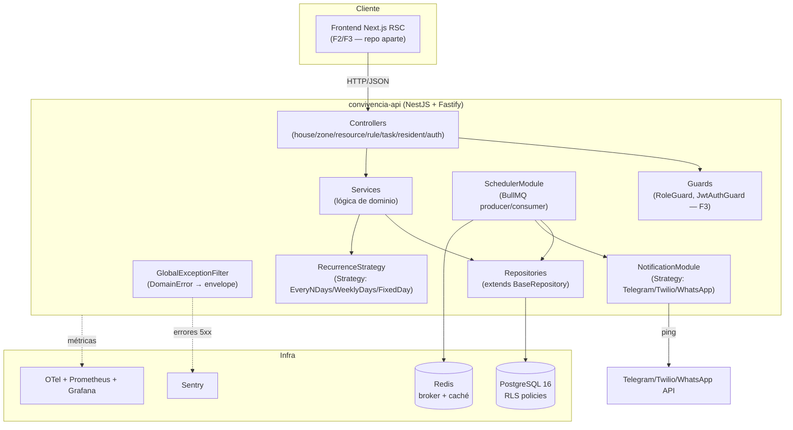

# Diagramas de Componentes (Flowcharts)

Proposito: mapa estable del sistema. Actualizar solo si cambia topologia.

## Contexto (alto nivel)

```mermaid
flowchart LR
    Owner["Owner/Manager\n(dueña)"] -->|HTTP| API
    Member["Member\n(Freddy, residents)"] -->|HTTP + ping| API

    API["convivencia-api\n(NestJS + Fastify)"] --> DB[(PostgreSQL 16\nRLS)]
    API --> Redis[(Redis)]
    API -->|jobs| Queue["BullMQ\n(scheduler recordatorios)"]
    Queue --> Redis
    API -->|errores| Sentry["Sentry\n(F1)"]
    API -->|métricas| OTel["OTel Collector\n(F2)"]
    OTel --> Prom["Prometheus"]
    Prom --> Grafana["Grafana"]

    Queue -->|ping vencido| Msg{"Canal mensajería"}
    Msg -->|F1| Telegram["Telegram Bot API\n/ Twilio sandbox"]
    Msg -->|F2/F3| WhatsApp["WhatsApp\nMeta Cloud API"]
    Telegram --> Member
    WhatsApp --> Member

    Owner -.->|F3| Google["Google OAuth"]
    Google -.-> API

    FE["Frontend Next.js\n(F2/F3, repo aparte)"] -.->|consume API| API
```

## Componentes principales

```mermaid
flowchart TB
    subgraph Cliente
        FE["Frontend Next.js RSC\n(F2/F3 — repo aparte)"]
    end

    subgraph API["convivencia-api (NestJS + Fastify)"]
        direction TB
        Ctrl["Controllers\n(house/zone/resource/rule/task/resident/auth)"]
        Svc["Services\n(lógica de dominio)"]
        Repo["Repositories\n(extends BaseRepository)"]
        Guard["Guards\n(RoleGuard, JwtAuthGuard — F3)"]
        Filter["GlobalExceptionFilter\n(DomainError → envelope)"]
        Sched["SchedulerModule\n(BullMQ producer/consumer)"]
        Notif["NotificationModule\n(Strategy: Telegram/Twilio/WhatsApp)"]
        Recur["RecurrenceStrategy\n(Strategy: EveryNDays/WeeklyDays/FixedDay)"]
    end

    subgraph Infra
        PG[(PostgreSQL 16\nRLS policies)]
        Redis[(Redis\nbroker + caché)]
        Sentry["Sentry"]
        OTelStack["OTel + Prometheus + Grafana"]
    end

    FE -->|HTTP/JSON| Ctrl
    Ctrl --> Guard
    Ctrl --> Svc
    Svc --> Repo
    Svc --> Recur
    Repo --> PG
    Sched --> Repo
    Sched --> Notif
    Notif -->|ping| External["Telegram/Twilio/WhatsApp API"]
    Filter -.->|errores 5xx| Sentry
    API -.->|métricas| OTelStack
    Sched --> Redis
```
